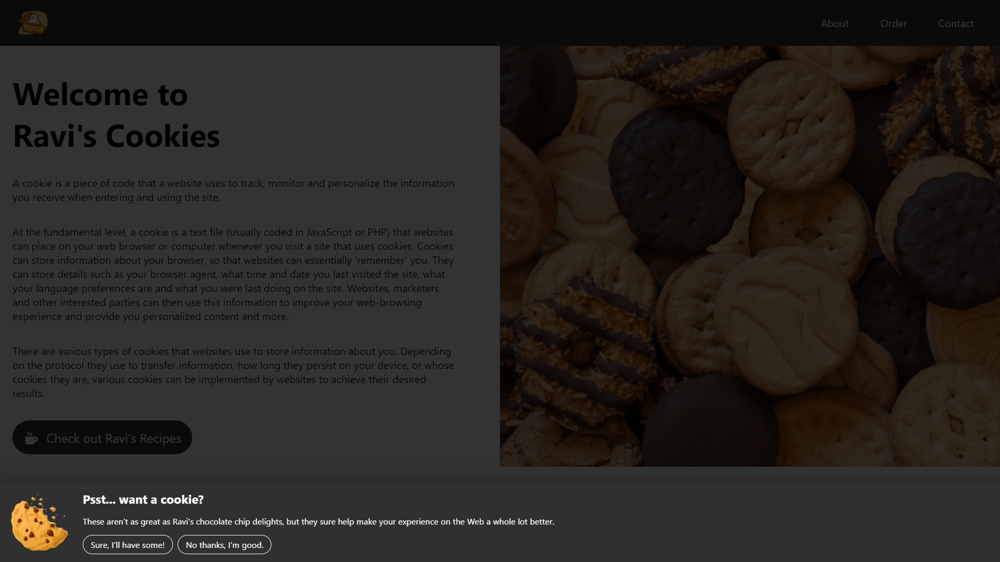

# Chocolate Chip Delights
 

 
This is a demo website built to show a basic cookie consent popup appearing in the form of a bar at the bottom of the site, placed above a translucent overlay.
 
This has been build purely with HTML, CSS and Vanilla JavaScript. No frameworks or libraries have been used.
 
 
## How It Works
 
The cookie consent bar appears over the website when it is refreshed. It appears above a translucent overlay which prevents the user from interacting with the website until they have interacted with the cookie consent bar.
 
The bar has two buttons; "Sure, I'll have one!" for accepting cookies and "No thanks, I'm good." for declining cookies. Interacting with either button will remove the bar and overlay from the website.
 
 
## TO-DO
 
- [ ] Add a cookie/cookies to the user's browser to remember their decision
- [ ] Fix mobile responsivity
- [ ] Add a "Learn More" capability to the bar
